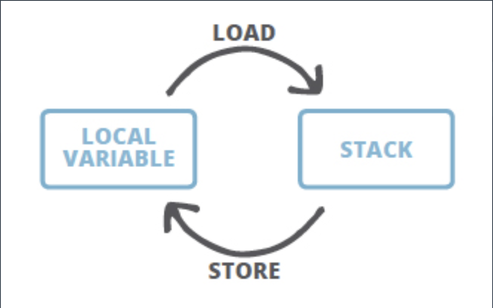
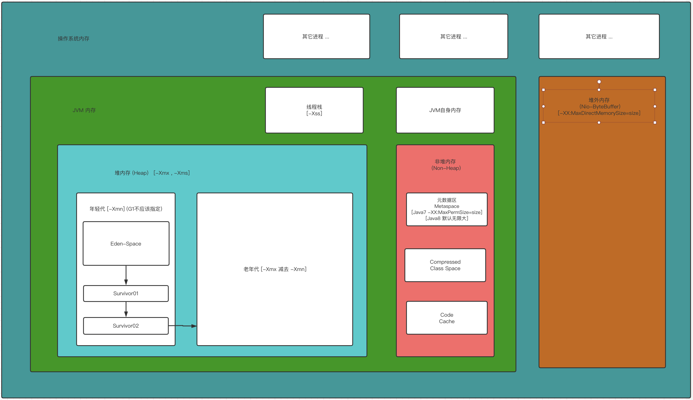

# Week1 学习笔记

## Java字节码

1. 什么是Java字节码？

    * Java bytecode 是Java代码与JVM沟通的一个中间状态，Java 字节码通过Java编译器 （Javac）生成 , 最终由JVM加载运行。
    * Java bytecode 由单字节(byte)的指令组成，理论上最多支持 256 个操作码(opcode)。 实际上 Java 只使用了200左右的操作码， 还有一些操作码则保留给调试操作。参考 : https://docs.oracle.com/javase/specs/jvms/se9/html/jvms-6.html#jvms-6.5.i2d
    * Java bytecode 的指令 （根据指令的性质） 可以分为4大类； 
        1. 栈操作指令，包括与局部变量交互的指令 
        2. 程序流程控制指令
        3. 对象操作指令，包括方法调用指令
        4. 算术运算以及类型转换指令
        
2. Java 字节码执行的过程

    字节码在执行的时候有两个区，一个本地变量区（LocalVariable）与一个栈区(Stack)，本地变量加载到栈区通过定义的指令运行，运行后的结果回写至本地变量表，循环往复，如下图。
    
    
    
    如下面的例子
    
   ``` 
    public class Test1{
        public static void main(String[] args){
            int a = 5;
            int b = 4;
            int c = 2;
            int d = a + b;
            int e = d * c;
        }
    } 
   ```
   执行 ： javac Test1.java && javap -v Test1.class 得到字节码
   ``` 
    Code:
         stack=2, locals=6, args_size=1
            0: iconst_5
            1: istore_1
                // 加载 a 到本地变量表
            2: iconst_4
            3: istore_2
                // 加载 b 到本地变量表
            4: iconst_2
            5: istore_3
                // 加载 c 到本地变量表
            6: iload_1
            7: iload_2
                // 加载 a,b 到栈 (iload_1  尾号对应的就是 istore_1 的尾号)
            8: iadd
                // 执行相加操作
            9: istore        4
                // d 回写到本地变量表
           11: iload         4
                // 加载 d 到栈
           13: iload_3
                // 加载 c 到栈
           14: imul
                // 执行乘法操作
           15: istore        5
                // 回写到本地变量
           17: return
   ```

3. 通过一个循环的例子来看Java bytecode 

``` 
public class Counter{
    private static final int NUM = 5;
    public final int num;
    public Counter(int initVlaue){
        this.num = initVlaue;
    }
    public static void main(String[] args){
        Counter counter = new Counter(NUM);
        int result = counter.forCount();
    }
    public int forCount(){
        int counter = 0;
        for (int i = 0;i<NUM;i++){
            counter += i;
        }
        return counter;
    }
}
```

执行： javac Counter.java &&  javap -v -l -p Counter.class

``` 
Classfile /Users/zhengyin/project/my/JAVA-000/Week_01/Counter.class
  Last modified 2020-10-20; size 516 bytes
  MD5 checksum 4cc8e4e0cdaecd05360c8e2d69f04d2d
  Compiled from "Counter.java"
public class Counter
  minor version: 0
  major version: 52
  flags: ACC_PUBLIC, ACC_SUPER
Constant pool:
   #1 = Methodref          #6.#23         // java/lang/Object."<init>":()V
   #2 = Fieldref           #3.#24         // Counter.num:I
   #3 = Class              #25            // Counter
   #4 = Methodref          #3.#26         // Counter."<init>":(I)V
   #5 = Methodref          #3.#27         // Counter.forCount:()I
   #6 = Class              #28            // java/lang/Object
   #7 = Utf8               NUM
   #8 = Utf8               I
   #9 = Utf8               ConstantValue
  #10 = Integer            5
  #11 = Utf8               num
  #12 = Utf8               <init>
  #13 = Utf8               (I)V
  #14 = Utf8               Code
  #15 = Utf8               LineNumberTable
  #16 = Utf8               main
  #17 = Utf8               ([Ljava/lang/String;)V
  #18 = Utf8               forCount
  #19 = Utf8               ()I
  #20 = Utf8               StackMapTable
  #21 = Utf8               SourceFile
  #22 = Utf8               Counter.java
  #23 = NameAndType        #12:#29        // "<init>":()V
  #24 = NameAndType        #11:#8         // num:I
  #25 = Utf8               Counter
  #26 = NameAndType        #12:#13        // "<init>":(I)V
  #27 = NameAndType        #18:#19        // forCount:()I
  #28 = Utf8               java/lang/Object
  #29 = Utf8               ()V
{
  private static final int NUM;
    descriptor: I
    flags: ACC_PRIVATE, ACC_STATIC, ACC_FINAL
    ConstantValue: int 5
        //私有的，静态的，最终的，常量值为5的NUM

  public final int num;
    descriptor: I
    flags: ACC_PUBLIC, ACC_FINAL

  public Counter(int);
    descriptor: (I)V
    flags: ACC_PUBLIC
    Code:
      stack=2, locals=2, args_size=2
         0: aload_0
         1: invokespecial #1                  // Method java/lang/Object."<init>":()V
         4: aload_0
         5: iload_1
         6: putfield      #2                  // Field num:I
         9: return
      LineNumberTable:
        line 4: 0
        line 5: 4
        line 6: 9

  public static void main(java.lang.String[]);
    descriptor: ([Ljava/lang/String;)V
    flags: ACC_PUBLIC, ACC_STATIC
    Code:
      stack=3, locals=3, args_size=1
         0: new           #3                  // class Counter
            //new指令在java堆上为Counter对象分配内存空间，并将地址压入操作数栈顶；
         3: dup
            //dup指令为复制操作数栈顶值，并将其压入栈顶，也就是说此时操作数栈上有连续相同的两个对象地址； 原理可以查看这里 https://www.cnblogs.com/CLAYJJ/archive/2017/10/20/7698035.html
         4: iconst_5
            //Load常量NUM
         5: invokespecial #4                  // Method "<init>":(I)V
            //调用 Counter 构造方法
         8: astore_1
            //存储 Counter 引用
         9: aload_1
           //加载  Counter 引用
        10: invokevirtual #5                  // Method forCount:()I
            //调用 counter forCount 
        13: istore_2
            //存储结果
        14: return
      LineNumberTable:
        line 8: 0
        line 9: 9
        line 10: 14

  public int forCount();
    descriptor: ()I
    flags: ACC_PUBLIC
    Code:
      stack=2, locals=3, args_size=1
         0: iconst_0
         1: istore_1
             // int counter = 0;
         2: iconst_0
         3: istore_2
             // for (int i = 0
         4: iload_2
         5: iconst_5
         6: if_icmpge     19
            //加载 i 与 NUM (5) 比较 , 如果满足条件走下面的流程，不满足走 19
         9: iload_1
        10: iload_2
        11: iadd
        12: istore_1
        13: iinc          2, 1
        16: goto          4
            //自增 i , 然后从回到 4 的流程，加载 i 与 NUM 在进行比较
        19: iload_1
            // 加载 counter 的值返回
        20: ireturn
      LineNumberTable:
        line 12: 0
        line 13: 2
        line 14: 9
        line 13: 13
        line 16: 19
      StackMapTable: number_of_entries = 2
        frame_type = 253 /* append */
          offset_delta = 4
          locals = [ int, int ]
        frame_type = 250 /* chop */
          offset_delta = 14
}
SourceFile: "Counter.java"

```

## ClassLoader

* ClassLoader的作用、类别与加载路径。

    1. ClassLoader作用
        ClassLoader的作用是将JVM字节码加载到JVM虚拟机。
    
    2. ClassLoader类别 
        1. 启动类加载器(BootstrapClassLoader) 
        2. 扩展类加载器(ExtClassLoader)
        3. 应用类加载器(AppClassLoader)
  
    3. 指定ClassLoader去那加载
        * 放到 JDK 的 lib/ext 下，或者-Djava.ext.dirs
        * java –cp/classpath 或者 class 文件放到当前路径
        * 通过反射的方法去获取URLClassLoader对象,在调用添加addURL添加加载路径
        
* 自定义ClassLoader
``` 
  package com.izhengyin.java000.week01;
  
  import java.io.File;
  import java.io.FileInputStream;
  import java.io.IOException;
  
  /**
   * @author zhengyin zhengyinit@outlook.com
   * Create on 2020/10/21 9:05 下午
   */
  public class CustomClassLoaderTest{
      public static void main(String[] args){
          MyClassLoader classLoader = new MyClassLoader("/Users/zhengyin/project/my/JAVA-000/Week_01/Hello.class");
          try {
              classLoader.findClass("Hello").newInstance();
          }catch (ClassNotFoundException e){
              e.printStackTrace();
          }catch (InstantiationException e){
              e.printStackTrace();
          }catch (IllegalAccessException e){
              e.printStackTrace();
          }
      }
  
      private static class MyClassLoader extends ClassLoader {
          private final String fileName;
          public MyClassLoader(String fileName){
              this.fileName = fileName;
          }
          @Override
          protected Class<?> findClass(String name) throws ClassNotFoundException {
              try {
                  byte[] bytes = readFile(this.fileName);
                  return defineClass(name,bytes,0,bytes.length);
              }catch (IOException e){
                  throw new ClassNotFoundException(e.getMessage(),e);
              }
          }
  
          private byte[] readFile(String fileName) throws IOException{
              File file = new File(fileName);
              byte[] bytes = new byte[(int)file.length()];
              FileInputStream in = null;
              try {
                  in = new FileInputStream(file);
                  in.read(bytes);
              } finally {
                  if(in != null){
                      in.close();
                  }
              }
              return bytes;
          }
      }
  }
  
  ```   
## Java内存结构



* JAVA进程占用内存首先分为两部分
    1. JVM内存
    2. 堆外内存（直接向操作系统申请的内存）[-XX:MaxDirectMemorySize=size 指定堆外内存大小]
* JVM内存可以划分为4个部分的内存
    1. 堆内存  [-Xmx , -Xms 分别指定最大堆大小和初始堆大小]
    2. 非堆内存
    3. 线程栈内存 [-Xss 指定线程栈大小，JAVA5以后默认是1M]
    4. JVM自身内存
* 堆内存(Heap)包含两个部分 
    1. 新生代 [-Xmn 指定内存大小，G1垃圾回收模型不指定][-XX:SurvivorRatio=n 指定 Eden , s0, s1 的比例]
        * Eden-Space [-Xmn / (n + 2) * n , 比如 n = 6 , -Xmn = 1000 , Eden = 1000 / (6+2) * 6 = 750]
        * Survivor01 [(-Xmn - Eden) / 2 , s1 , s2 相等]
        * Survivor02 
    2. 老年代 [-Xmx 减去 -Xmn 得到老年代的大小]
* 非堆内(Non-Heap)存包含三个部分
    1. metaspace [Java7 -XX:MaxPermSize=size] [Java8 默认无限大]
    2. Compressed Class Space
    3. Code Cache
    

            
    
   