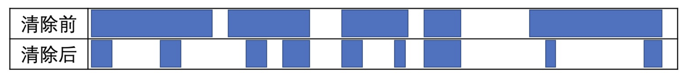
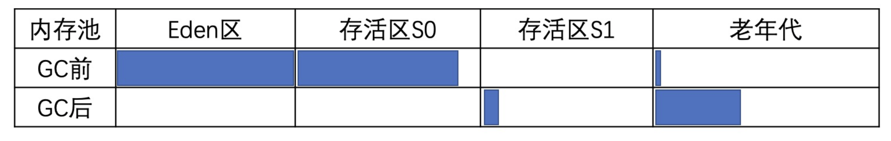
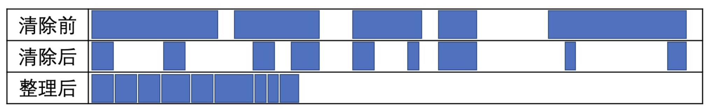
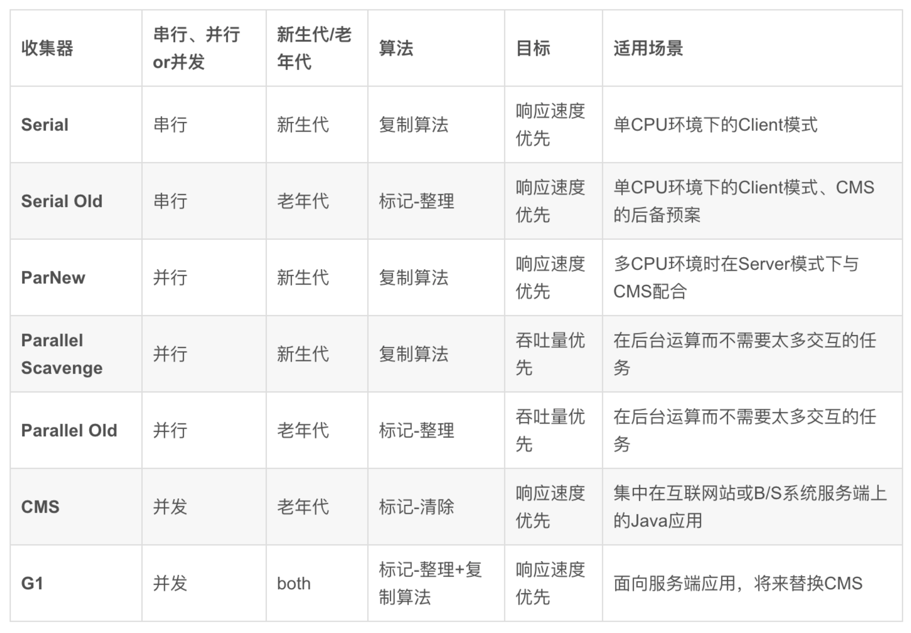

# Week1 Java字节码、ClassLoader、内存结构、垃圾回收

## Java字节码

1. 什么是Java字节码？

    * Java bytecode 是Java代码与JVM沟通的一个中间状态，Java 字节码通过Java编译器 （Javac）生成 , 最终由JVM加载运行。
    * Java bytecode 由单字节(byte)的指令组成，理论上最多支持 256 个操作码(opcode)。 实际上 Java 只使用了200左右的操作码， 还有一些操作码则保留给调试操作。参考 : https://docs.oracle.com/javase/specs/jvms/se9/html/jvms-6.html#jvms-6.5.i2d
    * Java bytecode 的指令 （根据指令的性质） 可以分为4大类； 
        1. 栈操作指令，包括与局部变量交互的指令 
        2. 程序流程控制指令
        3. 对象操作指令，包括方法调用指令
        4. 算术运算以及类型转换指令
        
2. Java 字节码执行的过程

    字节码在执行的时候有两个区，一个本地变量区（LocalVariable）与一个栈区(Stack)，本地变量加载到栈区通过定义的指令运行，运行后的结果回写至本地变量表，循环往复，如下图。
    
    
    
    如下面的例子
    
``` 
    public class Test1{
        public static void main(String[] args){
            int a = 5;
            int b = 4;
            int c = 2;
            int d = a + b;
            int e = d * c;
        }
    } 
```
   
   执行 ： javac Test1.java && javap -v Test1.class 得到字节码
   
``` 
    Code:
         stack=2, locals=6, args_size=1
            0: iconst_5
            1: istore_1
                // 加载 a 到本地变量表
            2: iconst_4
            3: istore_2
                // 加载 b 到本地变量表
            4: iconst_2
            5: istore_3
                // 加载 c 到本地变量表
            6: iload_1
            7: iload_2
                // 加载 a,b 到栈 (iload_1  尾号对应的就是 istore_1 的尾号)
            8: iadd
                // 执行相加操作
            9: istore        4
                // d 回写到本地变量表
           11: iload         4
                // 加载 d 到栈
           13: iload_3
                // 加载 c 到栈
           14: imul
                // 执行乘法操作
           15: istore        5
                // 回写到本地变量
           17: return
```

3. 通过一个循环的例子来看Java bytecode 

``` 
public class Counter{
    private static final int NUM = 5;
    public final int num;
    public Counter(int initVlaue){
        this.num = initVlaue;
    }
    public static void main(String[] args){
        Counter counter = new Counter(NUM);
        int result = counter.forCount();
    }
    public int forCount(){
        int counter = 0;
        for (int i = 0;i<NUM;i++){
            counter += i;
        }
        return counter;
    }
}
```

执行： javac Counter.java &&  javap -v -l -p Counter.class

``` 
Classfile /Users/zhengyin/project/my/JAVA-000/Week_01/Counter.class
  Last modified 2020-10-20; size 516 bytes
  MD5 checksum 4cc8e4e0cdaecd05360c8e2d69f04d2d
  Compiled from "Counter.java"
public class Counter
  minor version: 0
  major version: 52
  flags: ACC_PUBLIC, ACC_SUPER
Constant pool:
   #1 = Methodref          #6.#23         // java/lang/Object."<init>":()V
   #2 = Fieldref           #3.#24         // Counter.num:I
   #3 = Class              #25            // Counter
   #4 = Methodref          #3.#26         // Counter."<init>":(I)V
   #5 = Methodref          #3.#27         // Counter.forCount:()I
   #6 = Class              #28            // java/lang/Object
   #7 = Utf8               NUM
   #8 = Utf8               I
   #9 = Utf8               ConstantValue
  #10 = Integer            5
  #11 = Utf8               num
  #12 = Utf8               <init>
  #13 = Utf8               (I)V
  #14 = Utf8               Code
  #15 = Utf8               LineNumberTable
  #16 = Utf8               main
  #17 = Utf8               ([Ljava/lang/String;)V
  #18 = Utf8               forCount
  #19 = Utf8               ()I
  #20 = Utf8               StackMapTable
  #21 = Utf8               SourceFile
  #22 = Utf8               Counter.java
  #23 = NameAndType        #12:#29        // "<init>":()V
  #24 = NameAndType        #11:#8         // num:I
  #25 = Utf8               Counter
  #26 = NameAndType        #12:#13        // "<init>":(I)V
  #27 = NameAndType        #18:#19        // forCount:()I
  #28 = Utf8               java/lang/Object
  #29 = Utf8               ()V
{
  private static final int NUM;
    descriptor: I
    flags: ACC_PRIVATE, ACC_STATIC, ACC_FINAL
    ConstantValue: int 5
        //私有的，静态的，最终的，常量值为5的NUM

  public final int num;
    descriptor: I
    flags: ACC_PUBLIC, ACC_FINAL

  public Counter(int);
    descriptor: (I)V
    flags: ACC_PUBLIC
    Code:
      stack=2, locals=2, args_size=2
         0: aload_0
         1: invokespecial #1                  // Method java/lang/Object."<init>":()V
         4: aload_0
         5: iload_1
         6: putfield      #2                  // Field num:I
         9: return
      LineNumberTable:
        line 4: 0
        line 5: 4
        line 6: 9

  public static void main(java.lang.String[]);
    descriptor: ([Ljava/lang/String;)V
    flags: ACC_PUBLIC, ACC_STATIC
    Code:
      stack=3, locals=3, args_size=1
         0: new           #3                  // class Counter
            //new指令在java堆上为Counter对象分配内存空间，并将地址压入操作数栈顶；
         3: dup
            //dup指令为复制操作数栈顶值，并将其压入栈顶，也就是说此时操作数栈上有连续相同的两个对象地址； 原理可以查看这里 https://www.cnblogs.com/CLAYJJ/archive/2017/10/20/7698035.html
         4: iconst_5
            //Load常量NUM
         5: invokespecial #4                  // Method "<init>":(I)V
            //调用 Counter 构造方法
         8: astore_1
            //存储 Counter 引用
         9: aload_1
           //加载  Counter 引用
        10: invokevirtual #5                  // Method forCount:()I
            //调用 counter forCount 
        13: istore_2
            //存储结果
        14: return
      LineNumberTable:
        line 8: 0
        line 9: 9
        line 10: 14

  public int forCount();
    descriptor: ()I
    flags: ACC_PUBLIC
    Code:
      stack=2, locals=3, args_size=1
         0: iconst_0
         1: istore_1
             // int counter = 0;
         2: iconst_0
         3: istore_2
             // for (int i = 0
         4: iload_2
         5: iconst_5
         6: if_icmpge     19
            //加载 i 与 NUM (5) 比较 , 如果满足条件走下面的流程，不满足走 19
         9: iload_1
        10: iload_2
        11: iadd
        12: istore_1
        13: iinc          2, 1
        16: goto          4
            //自增 i , 然后从回到 4 的流程，加载 i 与 NUM 在进行比较
        19: iload_1
            // 加载 counter 的值返回
        20: ireturn
      LineNumberTable:
        line 12: 0
        line 13: 2
        line 14: 9
        line 13: 13
        line 16: 19
      StackMapTable: number_of_entries = 2
        frame_type = 253 /* append */
          offset_delta = 4
          locals = [ int, int ]
        frame_type = 250 /* chop */
          offset_delta = 14
}
SourceFile: "Counter.java"

```

## ClassLoader

* ClassLoader的作用、类别与加载路径。

    1. ClassLoader作用
        ClassLoader的作用是将JVM字节码加载到JVM虚拟机。
    
    2. ClassLoader类别 
        1. 启动类加载器(BootstrapClassLoader) 
        2. 扩展类加载器(ExtClassLoader)
        3. 应用类加载器(AppClassLoader)
  
    3. 指定ClassLoader去那加载
        * 放到 JDK 的 lib/ext 下，或者-Djava.ext.dirs
        * java –cp/classpath 或者 class 文件放到当前路径
        * 通过反射的方法去获取URLClassLoader对象,在调用添加addURL添加加载路径
        
* 自定义ClassLoader
``` 
  package com.izhengyin.java000.week01;
  
  import java.io.File;
  import java.io.FileInputStream;
  import java.io.IOException;
  
  /**
   * @author zhengyin zhengyinit@outlook.com
   * Create on 2020/10/21 9:05 下午
   */
  public class CustomClassLoaderTest{
      public static void main(String[] args){
          MyClassLoader classLoader = new MyClassLoader("/Users/zhengyin/project/my/JAVA-000/Week_01/Hello.class");
          try {
              classLoader.findClass("Hello").newInstance();
          }catch (ClassNotFoundException e){
              e.printStackTrace();
          }catch (InstantiationException e){
              e.printStackTrace();
          }catch (IllegalAccessException e){
              e.printStackTrace();
          }
      }
  
      private static class MyClassLoader extends ClassLoader {
          private final String fileName;
          public MyClassLoader(String fileName){
              this.fileName = fileName;
          }
          @Override
          protected Class<?> findClass(String name) throws ClassNotFoundException {
              try {
                  byte[] bytes = readFile(this.fileName);
                  return defineClass(name,bytes,0,bytes.length);
              }catch (IOException e){
                  throw new ClassNotFoundException(e.getMessage(),e);
              }
          }
  
          private byte[] readFile(String fileName) throws IOException{
              File file = new File(fileName);
              byte[] bytes = new byte[(int)file.length()];
              FileInputStream in = null;
              try {
                  in = new FileInputStream(file);
                  in.read(bytes);
              } finally {
                  if(in != null){
                      in.close();
                  }
              }
              return bytes;
          }
      }
  }
  
  ```   
## Java内存结构


* JAVA进程占用内存首先分为两部分
    1. JVM内存
    2. 堆外内存（直接向操作系统申请的内存）[-XX:MaxDirectMemorySize=size 指定堆外内存大小]
* JVM内存可以划分为4个部分的内存
    1. 堆内存  [-Xmx , -Xms 分别指定最大堆大小和初始堆大小]
    2. 非堆内存
    3. 线程栈内存 [-Xss 指定线程栈大小，JAVA5以后默认是1M]
    4. JVM自身内存
* 堆内存(Heap)包含两个部分 
    1. 新生代 [-Xmn 指定内存大小，G1垃圾回收模型不指定][-XX:SurvivorRatio=n 指定 Eden , s0, s1 的比例]
        * Eden-Space [-Xmn / (n + 2) * n , 比如 n = 6 , -Xmn = 1000 , Eden = 1000 / (6+2) * 6 = 750]
        * Survivor01 [(-Xmn - Eden) / 2 , s1 , s2 相等]
        * Survivor02 
    2. 老年代 [-Xmx 减去 -Xmn 得到老年代的大小]
* 非堆内(Non-Heap)存包含三个部分
    1. metaspace [Java7 -XX:MaxPermSize=size] [Java8 默认无限大]
    2. Compressed Class Space
    3. Code Cache
    
## Java内存垃圾回收

* Java如何确定哪些内存需要回收？
   * 可达性分析法 [https://blog.csdn.net/luzhensmart/article/details/81431212]

* Java垃圾回收算法

1. 标记-清除(Mark-Sweep)
    * 缺点： 内存清除回收后内存地址不连续，不利于二次分配
    
2. 标记-复制算法(Mark-Copy)
    * 会多占用一份内存地址，新生代采用一块较大的Eden空间和两块较小的Survivor空间在Survivor区使用此算法.
    
3. 标记-清除-整理算法(Mark-Sweep-Compact)
    * 解决 标记-复制算法 的问题，在老年代使用此算法
    

* STW
    * 在Java运行的过程中，不断有新对象被产生，引用，如和正确的标记数百万的对象。答案是Stop-The-World机制，简称STW，是在执行垃圾收集算法时，Java应用程序的其他所有线程都被挂起（除了垃圾收集帮助器之外），以此达到正确标记内存的目的。STW会导致Java应用程序停顿，因此优化SWT时间是Java垃圾收集器的核心。

## Java垃圾收集器

> 在STW机制下，Java垃圾收集器都能正确的回收内存，他们的不同点在于如何利用系统资源更快的完成垃圾回收的过程，从而达到减少应用停顿或不停顿的目的。

* 串行 GC(Serial GC)/ParNewGC 
    ```
        -XX:+UseSerialGC 配置串行GC 
        -XX:+USeParNewGC 配置ParNewGC
    ```
    
    * Serial GC 不能充分利用多核CPU资源，STW时间长。
        
        串行GC对年轻代使用 mark-copy(标记-复制) 算法，对老年代使用 mark-sweep-compact (标记-清除-整理)算法。两者都是单线程的垃圾收集器，不能进行并行处理，所以都会触发全线暂停(STW)，停止所有的应用线程。因此这种GC算法不能充分利用多核CPU。不管有多少CPU内核，JVM在垃圾收集时都只能使用单个核心。 
    
    * ParNew GC , 改进版本的 Serial GC，Serial收集器的多线程版本。
        
        -XX: +UseConcMarkSweepGC 默认的新生代收集器，在此模式下新生代采用 ParNew GC 老年代采用 CMS GC

* 并行 GC(Parallel GC) 

   ``` 
        -XX:+UseParallelGC  新生代开启并行GC
        -XX:+UseParallelOldGC  老年代开启并行GC
   ```

    > 年轻代和老年代的垃圾回收都会触发 STW 事件。在年轻代使用 标记-复制(mark-copy)算法，在老年代使用 标记-清除-整理(mark-sweep-compact)算法。-XX:ParallelGCThreads=N 来指定 GC 线程数， 其默认值为 CPU 核心数。
    
    * 并行GC利用多核CPU的资源
    
        • 在GC期间，所有CPU内核都在并行清理垃圾，所以总暂停时间更短
        
        • 在两次GC周期的间隔期，没有GC线程在运行，不会消耗任何系统资源

* CMS GC(Mostly Concurrent Mark and Sweep Garbage Collector) 

    ``` 
    -XX:+UseConcMarkSweepGC
    ```
  
  * CMS GC 的设计目标是避免在老年代垃圾收集时出现长时间的卡顿
  
     主要通过两种手段来达成此目标:
        1. 不对老年代进行整理，而是使用空闲列表(free-lists)来管理内存空间的回收。
        2. 在 mark-and-sweep (标记-清除) 阶段的大部分工作和应用线程一起并发执行。也就是说，在这些阶段并没有明显的应用线程暂停。但值得注意的是，它仍然和应用线程争抢 CPU 时间。默认情况下，CMS 使用的并发线程数等于 CPU 核心数的 1/4。
  
  > CMS 仅用于老年代，是过度版本的GC，在Java11中已经被G1 GC取代，它也有一些缺点，其中最大的问题就是老年 代内存碎片问题(因为不压缩)，在某些情况 下 GC 会造成不可预测的暂停时间，特别是堆内存较大的情况下。  
    
* G1 GC [适用于堆内存比较大的应用]
    
    ```
    -XX:+UseG1GC:启用 G1 GC;
    -XX:G1NewSizePercent:初始年轻代占整个 Java Heap 的大小，默认值为 5%;
    -XX:G1MaxNewSizePercent:最大年轻代占整个 Java Heap 的大小，默认值为 60%;
    -XX:G1HeapRegionSize:设置每个 Region 的大小，单位 MB，需要为 1，2，4，8，16，32 中的某个值，默 认是堆内存的 1/2000。如果这个值设置比较大，那么大对象就可以进入 Region 了。
    -XX:ConcGCThreads:与 Java 应用一起执行的 GC 线程数量，默认是 Java 线程的 1/4，减少这个参数的数值可 能会提升并行回收的效率，提高系统内部吞吐量。如果这个数值过低，参与回收垃圾的线程不足，也会导致并行回 收机制耗时加长。
    -XX:+InitiatingHeapOccupancyPercent(简称 IHOP):G1 内部并行回收循环启动的阈值，默认为 Java Heap 的 45%。这个可以理解为老年代使用大于等于 45% 的时候，JVM 会启动垃圾回收。这个值非常重要，它决定了在 什么时间启动老年代的并行回收。
    -XX:G1HeapWastePercent:G1停止回收的最小内存大小，默认是堆大小的 5%。GC 会收集所有的 Region 中 的对象，但是如果下降到了 5%，就会停下来不再收集了。就是说，不必每次回收就把所有的垃圾都处理完，可以 遗留少量的下次处理，这样也降低了单次消耗的时间。
    -XX:G1MixedGCCountTarget:设置并行循环之后需要有多少个混合 GC 启动，默认值是 8 个。老年代 Regions 的回收时间通常比年轻代的收集时间要长一些。所以如果混合收集器比较多，可以允许 G1 延长老年代的收集时间。
    -XX:+G1PrintRegionLivenessInfo:这个参数需要和 -XX:+UnlockDiagnosticVMOptions 配合启动，打印 JVM 的调试信息，每个 Region 里的对象存活信息。
    -XX:G1ReservePercent:G1 为了保留一些空间用于年代之间的提升，默认值是堆空间的 10%。因为大量执行回收的地方在年轻代(存活时间较短)，所以如果你的应用里面有比较大的堆内存空间、比较多的大对象存活，这里需要保留一些内存。 -XX:+G1SummarizeRSetStats:这也是一个 VM 的调试信息。如果启用，会在 VM 退出的时候打印出 Rsets 的详细总结信息。如果启用 -XX:G1SummaryRSetStatsPeriod 参数，就会阶段性地打印 Rsets 信息。 -XX:+G1TraceConcRefinement:这个也是一个 VM 的调试信息，如果启用，并行回收阶段的日志就会被详细打印出来。
    -XX:+GCTimeRatio:这个参数就是计算花在 Java 应用线程上和花在 GC 线程上的时间比率，默认是 9，跟新生代内存的分 配比例一致。这个参数主要的目的是让用户可以控制花在应用上的时间，G1 的计算公式是 100/(1+GCTimeRatio)。这样 如果参数设置为 9，则最多 10% 的时间会花在 GC 工作上面。Parallel GC 的默认值是 99，表示 1% 的时间被用在 GC 上面， 这是因为 Parallel GC 贯穿整个 GC，而 G1 则根据 Region 来进行划分，不需要全局性扫描整个内存堆。
    -XX:+UseStringDeduplication:手动开启 Java String 对象的去重工作，这个是 JDK8u20 版本之后新增的参数，主要用于 相同 String 避免重复申请内存，节约 Region 的使用。
    -XX:MaxGCPauseMills:预期 G1 每次执行 GC 操作的暂停时间，单位是毫秒，默认值是 200 毫秒，G1 会尽量保证控制在 这个范围内。
    ```

    G1 的全称是 Garbage-First，意为垃圾优先，哪 一块的垃圾最多就优先清理它。G1 GC 最主要的设计目标是:将 STW 停顿的时间 和分布，变成可预期且可配置的。事实上，G1 GC 是一款软实时垃圾收集器，可以为 其设置某项特定的性能指标。为了达成可预期停顿 时间的指标，G1 GC 有一些独特的实现。首先，堆不再分成年轻代和老年代，而是划分为多 个(通常是 2048 个)可以存放对象的 小块堆区域 (smaller heap regions)。每个小块，可能一会被 定义成 Eden 区，一会被指定为 Survivor区或者 Old 区。在逻辑上，所有的 Eden 区和 Survivor 区合起来就是年轻代，所有的 Old 区拼在一起那 就是老年代这样划分之后，使得 G1 不必每次都去收集整 个堆空间，而是以增量的方式来进行处理: 每 次只处理一部分内存块，称为此次 GC 的回收 集(collection set)。每次 GC 暂停都会收集所 有年轻代的内存块，但一般只包含部分老年代 的内存块。G1 的另一项创新是，在并发阶段估算每个小 堆块存活对象的总数。构建回收集的原则是: 垃圾最多的小块会被优先收集。这也是 G1 名 称的由来。


  > G1 GC采用分治思想，将内存拆分为多块，单独收集，从而将GC时间分散到应用运行的各个时间片，从而达到降低单次GC时间的目的。

  * G1 GC注意事项
      
    特别需要注意的是，某些情况下 G1 触发了 Full GC，这时 G1 会退化使用 Serial 收集器来完成垃圾的清理工作，
    它仅仅使用单线程来完成 GC 工作，GC 暂停时间将达到秒级别的。

* ZGC 下一代GC
    ```
    -XX:+UnlockExperimentalVMOptions -XX:+UseZGC -Xmx16g
    ```
    * 特点如下
        1. GC最大停顿时间不超过10ms
        2. 堆内存支持范围广，小至几百MB的堆空间，大至4TB的超大堆 内存(JDK13 升至 16TB)
        3. 与G1相比，应用吞吐量下降不超过15%
        4. 当前只支持Linux/x64位平台，JDK15后支持MacOS和 Windows 系统

* 各个GC对比

    
    
* 常用的 GC 组合 

    1. Serial+Serial Old 实现单线程的低延迟 垃圾回收机制
    2. ParNew+CMS，实现多线程的低延迟垃圾回收机制
    3. Parallel Scavenge和Parallel Scavenge Old，实现多线程的高吞吐量垃圾回收机制
    

    
   