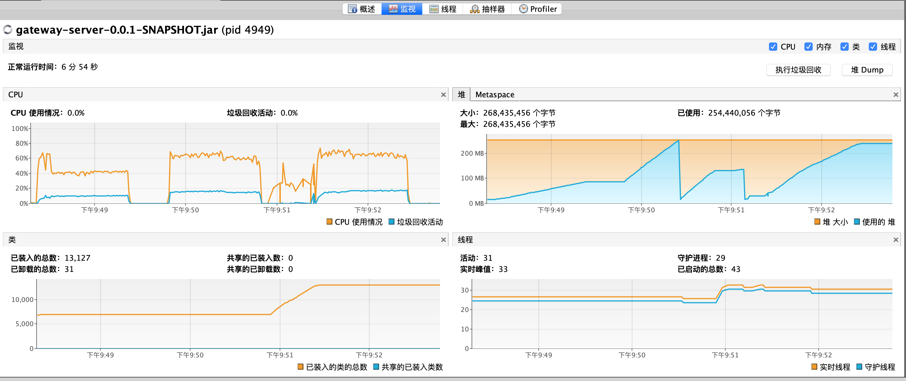

# GC日志分析、

## GC日志分析

* 参数
    ``` 
    -Xloggc:xxx.log  GC日志
    -XX:+PrintGCDetails  打印GC细节
    -XX:+PrintGCDateStamps 打印GC时间
    ```
* 演示一个空Java类，没有GC产生的情况，用于对比后面的输出
> java -Xloggc:empty.log -XX:+PrintGCDetails -XX:+PrintGCDateStamps -Xmx512m -Xms512m -Xmn256m Empty


``` 
Java HotSpot(TM) 64-Bit Server VM (25.65-b01) for bsd-amd64 JRE (1.8.0_65-b17), built on Oct  6 2015 15:36:46 by "java_re" with gcc 4.2.1 (Based on Apple Inc. build 5658) (LLVM build 2336.11.00)
Memory: 4k page, physical 16777216k(867384k free)

/proc/meminfo:

CommandLine flags: -XX:InitialHeapSize=268435456 -XX:MaxHeapSize=268435456 -XX:MaxNewSize=134217728 -XX:NewSize=134217728 -XX:+PrintGC -XX:+PrintGCDateStamps -XX:+PrintGCDetails -XX:+PrintGCTimeStamps -XX:+UseCompressedClassPointers -XX:+UseCompressedOops -XX:+UseParallelGC 
Heap
 PSYoungGen      total 114688K, used 7864K [0x00000007b8000000, 0x00000007c0000000, 0x00000007c0000000)
  eden space 98304K, 8% used [0x00000007b8000000,0x00000007b87ae390,0x00000007be000000)
  from space 16384K, 0% used [0x00000007bf000000,0x00000007bf000000,0x00000007c0000000)
  to   space 16384K, 0% used [0x00000007be000000,0x00000007be000000,0x00000007bf000000)
 ParOldGen       total 131072K, used 0K [0x00000007b0000000, 0x00000007b8000000, 0x00000007b8000000)
  object space 131072K, 0% used [0x00000007b0000000,0x00000007b0000000,0x00000007b8000000)
 Metaspace       used 2632K, capacity 4486K, committed 4864K, reserved 1056768K
  class space    used 290K, capacity 386K, committed 512K, reserved 1048576K

``` 

### 使用串行GC分析日志

> java -XX:+UseSerialGC -XX:+PrintGCDetails -XX:+PrintGCDateStamps -Xmx512m -Xms512m -Xmn256m GCLogAnalysis

``` 
Java HotSpot(TM) 64-Bit Server VM (25.65-b01) for bsd-amd64 JRE (1.8.0_65-b17), built on Oct  6 2015 15:36:46 by "java_re" with gcc 4.2.1 (Based on Apple Inc. build 5658) (LLVM build 2336.11.00)
Memory: 4k page, physical 16777216k(837272k free)

/proc/meminfo:

CommandLine flags: -XX:InitialHeapSize=536870912 -XX:MaxHeapSize=536870912 -XX:MaxNewSize=268435456 -XX:NewSize=268435456 -XX:+PrintGC -XX:+PrintGCDateStamps -XX:+PrintGCDetails -XX:+PrintGCTimeStamps -XX:+UseCompressedClassPointers -XX:+UseCompressedOops -XX:+UseSerialGC 
2020-10-27T13:59:12.528-0800: 0.254: [GC (Allocation Failure) 2020-10-27T13:59:12.528-0800: 0.254: [DefNew: 209641K->26176K(235968K), 0.0516494 secs] 209641K->70543K(498112K), 0.0517676 secs] [Times: user=0.03 sys=0.03, real=0.06 secs] 
2020-10-27T13:59:12.618-0800: 0.343: [GC (Allocation Failure) 2020-10-27T13:59:12.618-0800: 0.343: [DefNew: 235968K->26175K(235968K), 0.0631014 secs] 280335K->133460K(498112K), 0.0631809 secs] [Times: user=0.03 sys=0.03, real=0.07 secs] 
2020-10-27T13:59:12.717-0800: 0.443: [GC (Allocation Failure) 2020-10-27T13:59:12.717-0800: 0.443: [DefNew: 235967K->26175K(235968K), 0.0474224 secs] 343252K->191658K(498112K), 0.0475030 secs] [Times: user=0.02 sys=0.02, real=0.05 secs] 
2020-10-27T13:59:12.796-0800: 0.521: [GC (Allocation Failure) 2020-10-27T13:59:12.796-0800: 0.521: [DefNew: 235967K->26175K(235968K), 0.0503611 secs] 401450K->257056K(498112K), 0.0504377 secs] [Times: user=0.03 sys=0.02, real=0.05 secs] 
2020-10-27T13:59:12.880-0800: 0.605: [GC (Allocation Failure) 2020-10-27T13:59:12.880-0800: 0.605: [DefNew: 235967K->235967K(235968K), 0.0000193 secs]2020-10-27T13:59:12.880-0800: 0.605: [Tenured: 230881K->254474K(262144K), 0.0651560 secs] 466848K->254474K(498112K), [Metaspace: 2669K->2669K(1056768K)], 0.0652721 secs] [Times: user=0.05 sys=0.01, real=0.06 secs] 
2020-10-27T13:59:12.977-0800: 0.703: [GC (Allocation Failure) 2020-10-27T13:59:12.977-0800: 0.703: [DefNew: 209792K->209792K(235968K), 0.0000192 secs]2020-10-27T13:59:12.977-0800: 0.703: [Tenured: 254474K->261992K(262144K), 0.0478793 secs] 464266K->279022K(498112K), [Metaspace: 2669K->2669K(1056768K)], 0.0479830 secs] [Times: user=0.05 sys=0.00, real=0.05 secs] 
2020-10-27T13:59:13.059-0800: 0.784: [Full GC (Allocation Failure) 2020-10-27T13:59:13.059-0800: 0.784: [Tenured: 261992K->261953K(262144K), 0.0423020 secs] 497839K->301715K(498112K), [Metaspace: 2669K->2669K(1056768K)], 0.0423901 secs] [Times: user=0.04 sys=0.00, real=0.05 secs] 
2020-10-27T13:59:13.132-0800: 0.858: [Full GC (Allocation Failure) 2020-10-27T13:59:13.132-0800: 0.858: [Tenured: 262097K->262063K(262144K), 0.0465506 secs] 497960K->306186K(498112K), [Metaspace: 2669K->2669K(1056768K)], 0.0466466 secs] [Times: user=0.05 sys=0.00, real=0.04 secs] 
2020-10-27T13:59:13.210-0800: 0.936: [Full GC (Allocation Failure) 2020-10-27T13:59:13.210-0800: 0.936: [Tenured: 262063K->262119K(262144K), 0.0394282 secs] 497910K->327929K(498112K), [Metaspace: 2669K->2669K(1056768K)], 0.0395043 secs] [Times: user=0.04 sys=0.00, real=0.04 secs] 
2020-10-27T13:59:13.277-0800: 1.003: [Full GC (Allocation Failure) 2020-10-27T13:59:13.277-0800: 1.003: [Tenured: 262119K->261737K(262144K), 0.0445478 secs] 498055K->331972K(498112K), [Metaspace: 2669K->2669K(1056768K)], 0.0446495 secs] [Times: user=0.04 sys=0.00, real=0.05 secs] 
2020-10-27T13:59:13.349-0800: 1.074: [Full GC (Allocation Failure) 2020-10-27T13:59:13.349-0800: 1.075: [Tenured: 262111K->261873K(262144K), 0.0479787 secs] 497996K->340998K(498112K), [Metaspace: 2669K->2669K(1056768K)], 0.0480689 secs] [Times: user=0.04 sys=0.00, real=0.05 secs] 
Heap
 def new generation   total 235968K, used 87367K [0x00000007a0000000, 0x00000007b0000000, 0x00000007b0000000)
  eden space 209792K,  41% used [0x00000007a0000000, 0x00000007a5551ff8, 0x00000007acce0000)
  from space 26176K,   0% used [0x00000007acce0000, 0x00000007acce0000, 0x00000007ae670000)
  to   space 26176K,   0% used [0x00000007ae670000, 0x00000007ae670000, 0x00000007b0000000)
 tenured generation   total 262144K, used 261873K [0x00000007b0000000, 0x00000007c0000000, 0x00000007c0000000)
   the space 262144K,  99% used [0x00000007b0000000, 0x00000007bffbc590, 0x00000007bffbc600, 0x00000007c0000000)
 Metaspace       used 2676K, capacity 4486K, committed 4864K, reserved 1056768K
  class space    used 293K, capacity 386K, committed 512K, reserved 1048576K

```

- Minor GC 最大执行时间 0.703s ， GC 次数 6 次
- Major GC 最大执行时间 1.074s ， GC 次数 5 次

### 使用并行GC分析日志

> java -XX:+UseParallelGC -XX:+UseParallelOldGC -XX:+PrintGCDetails -XX:+PrintGCDateStamps -Xmx512m -Xms512m -Xmn256m GCLogAnalysis


``` 
2020-10-27T14:19:07.785-0800: [GC (Allocation Failure) [PSYoungGen: 196608K->32766K(229376K)] 196608K->63849K(491520K), 0.0293529 secs] [Times: user=0.04 sys=0.13, real=0.03 secs]
2020-10-27T14:19:07.850-0800: [GC (Allocation Failure) [PSYoungGen: 229374K->32765K(229376K)] 260457K->120540K(491520K), 0.0436931 secs] [Times: user=0.05 sys=0.18, real=0.04 secs]
2020-10-27T14:19:07.923-0800: [GC (Allocation Failure) [PSYoungGen: 229373K->32758K(229376K)] 317148K->174570K(491520K), 0.0300087 secs] [Times: user=0.05 sys=0.12, real=0.03 secs]
2020-10-27T14:19:07.982-0800: [GC (Allocation Failure) [PSYoungGen: 229366K->32758K(229376K)] 371178K->238441K(491520K), 0.0401816 secs] [Times: user=0.05 sys=0.16, real=0.04 secs]
2020-10-27T14:19:08.022-0800: [Full GC (Ergonomics) [PSYoungGen: 32758K->0K(229376K)] [ParOldGen: 205682K->198050K(262144K)] 238441K->198050K(491520K), [Metaspace: 2669K->2669K(1056768K)], 0.0310467 secs] [Times: user=0.16 sys=0.01, real=0.03 secs]
2020-10-27T14:19:08.087-0800: [Full GC (Ergonomics) [PSYoungGen: 196402K->0K(229376K)] [ParOldGen: 198050K->227580K(262144K)] 394453K->227580K(491520K), [Metaspace: 2669K->2669K(1056768K)], 0.0425555 secs] [Times: user=0.15 sys=0.05, real=0.05 secs]
2020-10-27T14:19:08.163-0800: [Full GC (Ergonomics) [PSYoungGen: 196293K->0K(229376K)] [ParOldGen: 227580K->259998K(262144K)] 423873K->259998K(491520K), [Metaspace: 2669K->2669K(1056768K)], 0.0421513 secs] [Times: user=0.14 sys=0.07, real=0.04 secs]
2020-10-27T14:19:08.242-0800: [Full GC (Ergonomics) [PSYoungGen: 196608K->24843K(229376K)] [ParOldGen: 259998K->261802K(262144K)] 456606K->286646K(491520K), [Metaspace: 2669K->2669K(1056768K)], 0.0371849 secs] [Times: user=0.19 sys=0.01, real=0.03 secs]
2020-10-27T14:19:08.312-0800: [Full GC (Ergonomics) [PSYoungGen: 196608K->39678K(229376K)] [ParOldGen: 261802K->261850K(262144K)] 458410K->301529K(491520K), [Metaspace: 2669K->2669K(1056768K)], 0.0388851 secs] [Times: user=0.21 sys=0.00, real=0.04 secs]
2020-10-27T14:19:08.385-0800: [Full GC (Ergonomics) [PSYoungGen: 196291K->50092K(229376K)] [ParOldGen: 261850K->261952K(262144K)] 458142K->312045K(491520K), [Metaspace: 2669K->2669K(1056768K)], 0.0394106 secs] [Times: user=0.21 sys=0.01, real=0.04 secs]
2020-10-27T14:19:08.455-0800: [Full GC (Ergonomics) [PSYoungGen: 196528K->62130K(229376K)] [ParOldGen: 261952K->262121K(262144K)] 458481K->324252K(491520K), [Metaspace: 2669K->2669K(1056768K)], 0.0431801 secs] [Times: user=0.22 sys=0.00, real=0.04 secs]
2020-10-27T14:19:08.527-0800: [Full GC (Ergonomics) [PSYoungGen: 196608K->66649K(229376K)] [ParOldGen: 262121K->261418K(262144K)] 458729K->328068K(491520K), [Metaspace: 2669K->2669K(1056768K)], 0.0416935 secs] [Times: user=0.22 sys=0.00, real=0.04 secs]
2020-10-27T14:19:08.598-0800: [Full GC (Ergonomics) [PSYoungGen: 196257K->72886K(229376K)] [ParOldGen: 261418K->261399K(262144K)] 457675K->334286K(491520K), [Metaspace: 2669K->2669K(1056768K)], 0.0421142 secs] [Times: user=0.25 sys=0.01, real=0.05 secs]
执行结束!共生成对象次数:8019
Heap
 PSYoungGen      total 229376K, used 125845K [0x00000007b0000000, 0x00000007c0000000, 0x00000007c0000000)
  eden space 196608K, 64% used [0x00000007b0000000,0x00000007b7ae55c0,0x00000007bc000000)
  from space 32768K, 0% used [0x00000007be000000,0x00000007be000000,0x00000007c0000000)
  to   space 32768K, 0% used [0x00000007bc000000,0x00000007bc000000,0x00000007be000000)
 ParOldGen       total 262144K, used 261399K [0x00000007a0000000, 0x00000007b0000000, 0x00000007b0000000)
  object space 262144K, 99% used [0x00000007a0000000,0x00000007aff45d78,0x00000007b0000000)
 Metaspace       used 2676K, capacity 4486K, committed 4864K, reserved 1056768K
  class space    used 293K, capacity 386K, committed 512K, reserved 1048576K
```

- Minor GC 最大执行时间 0.029s ， GC 次数 4 次
- Major GC 最大执行时间 0.043s ， GC 次数 9 次

### 使用CMS GC分析日志

> java  -XX:+UseConcMarkSweepGC -XX:+PrintGCDetails -XX:+PrintGCDateStamps -Xmx512m -Xms512m -Xmn256m GCLogAnalysis

``` 
2020-10-27T14:30:04.513-0800: [GC (Allocation Failure) 2020-10-27T14:30:04.513-0800: [ParNew: 209792K->26175K(235968K), 0.0394291 secs] 209792K->64872K(498112K), 0.0394948 secs] [Times: user=0.06 sys=0.14, real=0.04 secs]
2020-10-27T14:30:04.596-0800: [GC (Allocation Failure) 2020-10-27T14:30:04.596-0800: [ParNew: 235849K->26173K(235968K), 0.0402348 secs] 274546K->123640K(498112K), 0.0402794 secs] [Times: user=0.06 sys=0.15, real=0.04 secs]
2020-10-27T14:30:04.677-0800: [GC (Allocation Failure) 2020-10-27T14:30:04.677-0800: [ParNew: 235965K->26176K(235968K), 0.0470529 secs] 333432K->177789K(498112K), 0.0470946 secs] [Times: user=0.29 sys=0.02, real=0.05 secs]
2020-10-27T14:30:04.724-0800: [GC (CMS Initial Mark) [1 CMS-initial-mark: 151613K(262144K)] 178254K(498112K), 0.0006110 secs] [Times: user=0.00 sys=0.00, real=0.00 secs]
2020-10-27T14:30:04.725-0800: [CMS-concurrent-mark-start]
2020-10-27T14:30:04.727-0800: [CMS-concurrent-mark: 0.002/0.002 secs] [Times: user=0.00 sys=0.01, real=0.00 secs]
2020-10-27T14:30:04.727-0800: [CMS-concurrent-preclean-start]
2020-10-27T14:30:04.728-0800: [CMS-concurrent-preclean: 0.001/0.001 secs] [Times: user=0.00 sys=0.00, real=0.00 secs]
2020-10-27T14:30:04.728-0800: [CMS-concurrent-abortable-preclean-start]
2020-10-27T14:30:04.761-0800: [GC (Allocation Failure) 2020-10-27T14:30:04.761-0800: [ParNew: 235968K->26174K(235968K), 0.0667502 secs] 387581K->237836K(498112K), 0.0667924 secs] [Times: user=0.32 sys=0.03, real=0.06 secs]
2020-10-27T14:30:04.874-0800: [GC (Allocation Failure) 2020-10-27T14:30:04.874-0800: [ParNew: 235966K->235966K(235968K), 0.0000283 secs]2020-10-27T14:30:04.874-0800: [CMS2020-10-27T14:30:04.874-0800: [CMS-concurrent-abortable-preclean: 0.002/0.146 secs] [Times: user=0.41 sys=0.03, real=0.15 secs]
 (concurrent mode failure): 211661K->226785K(262144K), 0.0686105 secs] 447628K->226785K(498112K), [Metaspace: 2669K->2669K(1056768K)], 0.0687036 secs] [Times: user=0.06 sys=0.01, real=0.07 secs]
2020-10-27T14:30:04.979-0800: [GC (Allocation Failure) 2020-10-27T14:30:04.979-0800: [ParNew: 209792K->209792K(235968K), 0.0000210 secs]2020-10-27T14:30:04.980-0800: [CMS: 226785K->251051K(262144K), 0.0545695 secs] 436577K->251051K(498112K), [Metaspace: 2669K->2669K(1056768K)], 0.0546482 secs] [Times: user=0.04 sys=0.01, real=0.06 secs]
2020-10-27T14:30:05.034-0800: [GC (CMS Initial Mark) [1 CMS-initial-mark: 251051K(262144K)] 251393K(498112K), 0.0002498 secs] [Times: user=0.00 sys=0.00, real=0.00 secs]
2020-10-27T14:30:05.035-0800: [CMS-concurrent-mark-start]
2020-10-27T14:30:05.036-0800: [CMS-concurrent-mark: 0.002/0.002 secs] [Times: user=0.01 sys=0.00, real=0.00 secs]
2020-10-27T14:30:05.036-0800: [CMS-concurrent-preclean-start]
2020-10-27T14:30:05.037-0800: [CMS-concurrent-preclean: 0.001/0.001 secs] [Times: user=0.00 sys=0.00, real=0.00 secs]
2020-10-27T14:30:05.038-0800: [CMS-concurrent-abortable-preclean-start]
2020-10-27T14:30:05.038-0800: [CMS-concurrent-abortable-preclean: 0.000/0.000 secs] [Times: user=0.00 sys=0.00, real=0.00 secs]
2020-10-27T14:30:05.038-0800: [GC (CMS Final Remark) [YG occupancy: 13168 K (235968 K)]2020-10-27T14:30:05.038-0800: [Rescan (parallel) , 0.0002535 secs]2020-10-27T14:30:05.038-0800: [weak refs processing, 0.0000186 secs]2020-10-27T14:30:05.038-0800: [class unloading, 0.0002334 secs]2020-10-27T14:30:05.038-0800: [scrub symbol table, 0.0003466 secs]2020-10-27T14:30:05.039-0800: [scrub string table, 0.0001432 secs][1 CMS-remark: 251051K(262144K)] 264220K(498112K), 0.0011181 secs] [Times: user=0.00 sys=0.00, real=0.00 secs]
2020-10-27T14:30:05.039-0800: [CMS-concurrent-sweep-start]
2020-10-27T14:30:05.040-0800: [CMS-concurrent-sweep: 0.001/0.001 secs] [Times: user=0.00 sys=0.00, real=0.01 secs]
2020-10-27T14:30:05.040-0800: [CMS-concurrent-reset-start]
2020-10-27T14:30:05.040-0800: [CMS-concurrent-reset: 0.000/0.000 secs] [Times: user=0.00 sys=0.00, real=0.00 secs]
2020-10-27T14:30:05.074-0800: [GC (Allocation Failure) 2020-10-27T14:30:05.074-0800: [ParNew: 209792K->209792K(235968K), 0.0000232 secs]2020-10-27T14:30:05.074-0800: [CMS: 250087K->261725K(262144K), 0.0540667 secs] 459879K->269735K(498112K), [Metaspace: 2669K->2669K(1056768K)], 0.0541803 secs] [Times: user=0.05 sys=0.01, real=0.05 secs]
2020-10-27T14:30:05.128-0800: [GC (CMS Initial Mark) [1 CMS-initial-mark: 261725K(262144K)] 269775K(498112K), 0.0001582 secs] [Times: user=0.00 sys=0.00, real=0.00 secs]
2020-10-27T14:30:05.129-0800: [CMS-concurrent-mark-start]
2020-10-27T14:30:05.130-0800: [CMS-concurrent-mark: 0.001/0.001 secs] [Times: user=0.00 sys=0.00, real=0.01 secs]
2020-10-27T14:30:05.130-0800: [CMS-concurrent-preclean-start]
2020-10-27T14:30:05.131-0800: [CMS-concurrent-preclean: 0.001/0.001 secs] [Times: user=0.00 sys=0.00, real=0.00 secs]
2020-10-27T14:30:05.131-0800: [CMS-concurrent-abortable-preclean-start]
2020-10-27T14:30:05.131-0800: [CMS-concurrent-abortable-preclean: 0.000/0.000 secs] [Times: user=0.00 sys=0.00, real=0.00 secs]
2020-10-27T14:30:05.131-0800: [GC (CMS Final Remark) [YG occupancy: 25936 K (235968 K)]2020-10-27T14:30:05.131-0800: [Rescan (parallel) , 0.0010231 secs]2020-10-27T14:30:05.133-0800: [weak refs processing, 0.0000131 secs]2020-10-27T14:30:05.133-0800: [class unloading, 0.0002208 secs]2020-10-27T14:30:05.133-0800: [scrub symbol table, 0.0003585 secs]2020-10-27T14:30:05.133-0800: [scrub string table, 0.0002288 secs][1 CMS-remark: 261725K(262144K)] 287662K(498112K), 0.0020158 secs] [Times: user=0.01 sys=0.00, real=0.00 secs]
2020-10-27T14:30:05.134-0800: [CMS-concurrent-sweep-start]
2020-10-27T14:30:05.134-0800: [CMS-concurrent-sweep: 0.001/0.001 secs] [Times: user=0.00 sys=0.00, real=0.00 secs]
2020-10-27T14:30:05.134-0800: [CMS-concurrent-reset-start]
2020-10-27T14:30:05.134-0800: [CMS-concurrent-reset: 0.000/0.000 secs] [Times: user=0.00 sys=0.00, real=0.00 secs]
2020-10-27T14:30:05.169-0800: [GC (Allocation Failure) 2020-10-27T14:30:05.169-0800: [ParNew: 235905K->235905K(235968K), 0.0000252 secs]2020-10-27T14:30:05.169-0800: [CMS: 261622K->261837K(262144K), 0.0480506 secs] 497528K->281386K(498112K), [Metaspace: 2669K->2669K(1056768K)], 0.0481399 secs] [Times: user=0.04 sys=0.00, real=0.05 secs]
2020-10-27T14:30:05.218-0800: [GC (CMS Initial Mark) [1 CMS-initial-mark: 261837K(262144K)] 281674K(498112K), 0.0002131 secs] [Times: user=0.00 sys=0.00, real=0.00 secs]
2020-10-27T14:30:05.218-0800: [CMS-concurrent-mark-start]
2020-10-27T14:30:05.219-0800: [CMS-concurrent-mark: 0.001/0.001 secs] [Times: user=0.01 sys=0.00, real=0.00 secs]
2020-10-27T14:30:05.219-0800: [CMS-concurrent-preclean-start]
2020-10-27T14:30:05.221-0800: [CMS-concurrent-preclean: 0.001/0.001 secs] [Times: user=0.00 sys=0.00, real=0.01 secs]
2020-10-27T14:30:05.221-0800: [CMS-concurrent-abortable-preclean-start]
2020-10-27T14:30:05.221-0800: [CMS-concurrent-abortable-preclean: 0.000/0.000 secs] [Times: user=0.00 sys=0.00, real=0.00 secs]
2020-10-27T14:30:05.221-0800: [GC (CMS Final Remark) [YG occupancy: 42728 K (235968 K)]2020-10-27T14:30:05.221-0800: [Rescan (parallel) , 0.0011623 secs]2020-10-27T14:30:05.222-0800: [weak refs processing, 0.0000165 secs]2020-10-27T14:30:05.222-0800: [class unloading, 0.0003157 secs]2020-10-27T14:30:05.223-0800: [scrub symbol table, 0.0005116 secs]2020-10-27T14:30:05.223-0800: [scrub string table, 0.0002069 secs][1 CMS-remark: 261837K(262144K)] 304566K(498112K), 0.0023177 secs] [Times: user=0.01 sys=0.00, real=0.00 secs]
2020-10-27T14:30:05.223-0800: [CMS-concurrent-sweep-start]
2020-10-27T14:30:05.224-0800: [CMS-concurrent-sweep: 0.001/0.001 secs] [Times: user=0.00 sys=0.00, real=0.00 secs]
2020-10-27T14:30:05.224-0800: [CMS-concurrent-reset-start]
2020-10-27T14:30:05.225-0800: [CMS-concurrent-reset: 0.000/0.000 secs] [Times: user=0.00 sys=0.00, real=0.00 secs]
2020-10-27T14:30:05.269-0800: [GC (Allocation Failure) 2020-10-27T14:30:05.269-0800: [ParNew: 235506K->235506K(235968K), 0.0001250 secs]2020-10-27T14:30:05.269-0800: [CMS: 261332K->262130K(262144K), 0.0558051 secs] 496839K->300333K(498112K), [Metaspace: 2669K->2669K(1056768K)], 0.0559969 secs] [Times: user=0.05 sys=0.00, real=0.06 secs]
2020-10-27T14:30:05.325-0800: [GC (CMS Initial Mark) [1 CMS-initial-mark: 262130K(262144K)] 300871K(498112K), 0.0002285 secs] [Times: user=0.00 sys=0.00, real=0.00 secs]
2020-10-27T14:30:05.325-0800: [CMS-concurrent-mark-start]
2020-10-27T14:30:05.327-0800: [CMS-concurrent-mark: 0.001/0.001 secs] [Times: user=0.00 sys=0.00, real=0.00 secs]
2020-10-27T14:30:05.327-0800: [CMS-concurrent-preclean-start]
2020-10-27T14:30:05.328-0800: [CMS-concurrent-preclean: 0.001/0.001 secs] [Times: user=0.00 sys=0.00, real=0.00 secs]
2020-10-27T14:30:05.328-0800: [CMS-concurrent-abortable-preclean-start]
2020-10-27T14:30:05.328-0800: [CMS-concurrent-abortable-preclean: 0.000/0.000 secs] [Times: user=0.00 sys=0.00, real=0.00 secs]
2020-10-27T14:30:05.328-0800: [GC (CMS Final Remark) [YG occupancy: 57863 K (235968 K)]2020-10-27T14:30:05.328-0800: [Rescan (parallel) , 0.0002974 secs]2020-10-27T14:30:05.329-0800: [weak refs processing, 0.0000188 secs]2020-10-27T14:30:05.329-0800: [class unloading, 0.0002139 secs]2020-10-27T14:30:05.329-0800: [scrub symbol table, 0.0003208 secs]2020-10-27T14:30:05.329-0800: [scrub string table, 0.0001298 secs][1 CMS-remark: 262130K(262144K)] 319994K(498112K), 0.0010578 secs] [Times: user=0.00 sys=0.00, real=0.00 secs]
2020-10-27T14:30:05.329-0800: [CMS-concurrent-sweep-start]
2020-10-27T14:30:05.330-0800: [CMS-concurrent-sweep: 0.000/0.000 secs] [Times: user=0.00 sys=0.00, real=0.01 secs]
2020-10-27T14:30:05.330-0800: [CMS-concurrent-reset-start]
2020-10-27T14:30:05.330-0800: [CMS-concurrent-reset: 0.000/0.000 secs] [Times: user=0.00 sys=0.00, real=0.00 secs]
2020-10-27T14:30:05.362-0800: [GC (Allocation Failure) 2020-10-27T14:30:05.362-0800: [ParNew: 235796K->235796K(235968K), 0.0000238 secs]2020-10-27T14:30:05.362-0800: [CMS: 261570K->262140K(262144K), 0.0501375 secs] 497367K->312887K(498112K), [Metaspace: 2669K->2669K(1056768K)], 0.0502278 secs] [Times: user=0.05 sys=0.00, real=0.05 secs]
2020-10-27T14:30:05.412-0800: [GC (CMS Initial Mark) [1 CMS-initial-mark: 262140K(262144K)] 313077K(498112K), 0.0002138 secs] [Times: user=0.00 sys=0.00, real=0.00 secs]
2020-10-27T14:30:05.413-0800: [CMS-concurrent-mark-start]
执行结束!共生成对象次数:7979
Heap
 par new generation   total 235968K, used 59228K [0x00000007a0000000, 0x00000007b0000000, 0x00000007b0000000)
  eden space 209792K,  28% used [0x00000007a0000000, 0x00000007a39d71e0, 0x00000007acce0000)
  from space 26176K,   0% used [0x00000007acce0000, 0x00000007acce0000, 0x00000007ae670000)
  to   space 26176K,   0% used [0x00000007ae670000, 0x00000007ae670000, 0x00000007b0000000)
 concurrent mark-sweep generation total 262144K, used 262140K [0x00000007b0000000, 0x00000007c0000000, 0x00000007c0000000)
 Metaspace       used 2676K, capacity 4486K, committed 4864K, reserved 1056768K
  class space    used 293K, capacity 386K, committed 512K, reserved 1048576K
```

通过日志可以看到，CMS的新生代使使用ParNew来进行GC，老年代使用CMS来进行GC。

* CMS分为了下面几个阶段
    阶段 1: Initial Mark(初始标记)
    阶段 2: Concurrent Mark(并发标记)
    阶段 3: Concurrent Preclean(并发预清理) 
    阶段 4: Final Remark(最终标记)
    阶段 5: Concurrent Sweep(并发清除) 
    阶段 6: Concurrent Reset(并发重置)

### 使用G1 GC分析日志

> java  -XX:+UseG1GC -Xloggc:g1.log -XX:+PrintGCDetails -XX:+PrintGCDateStamps -Xmx512m -Xms512m -Xmn256m GCLogAnalysis

G1 日志太大查看 [G1](g1.log)


## 压测 与观察 gateway demo

``` 
java -jar -Xmx256m -Xms256m -Xmn128  gateway-server-0.0.1-SNAPSHOT.jar
```

``` 
~ wrk -c 5 -t 5 -d 60s http://127.0.0.1:8088/api/hello
Running 1m test @ http://127.0.0.1:8088/api/hello
  5 threads and 5 connections
  Thread Stats   Avg      Stdev     Max   +/- Stdev
    Latency     1.42ms    2.96ms  97.51ms   95.76%
    Req/Sec     1.20k   255.49     2.01k    82.68%
  359885 requests in 1.00m, 42.97MB read
Requests/sec:   5988.74
Transfer/sec:    732.16KB
```
 


## okHttp,httpClient,WebClient 测试
```  
/**
 * @author zhengyin zhengyinit@outlook.com
 * Created on 2020-10-28 17:34
 */
public class SomeRequestTest {

    private static final OkHttpClient OK_HTTP_CLIENT = new OkHttpClient();
    private static final WebClient WEB_CLIENT = WebClient.builder().build();

    public static void main(String[] args) throws IOException,InterruptedException{
        Map<String,String> headers = new HashMap<String, String>();
        headers.put("SomeRequestTest","xxx");
        String url = "http://httpbin.org/get";
        doOkHttp(url,headers);
        doHttpClient(url,headers);
        doWebClient(url,headers);
        TimeUnit.SECONDS.sleep(1);
    }

    private static void doOkHttp(String url , Map<String,String> customHeaders) throws IOException {
        Request.Builder builder = new Request.Builder()
                .url(url);
        customHeaders.forEach(builder::header);
        builder.header("user-agent","okHttpClient");
        Request request = builder.build();
        try (Response response = OK_HTTP_CLIENT.newCall(request).execute()) {
            System.out.println(response.body().string());
        }
    }

    private static void doHttpClient(String url , Map<String,String> customHeaders) throws IOException{
        CloseableHttpClient httpclient = HttpClients.createDefault();
        HttpGet httpget = new HttpGet(url);
        customHeaders.forEach(httpget::setHeader);
        httpget.setHeader("user-agent","httpClient");
        CloseableHttpResponse response = httpclient.execute(httpget);
        try {
           if (response.getStatusLine().getStatusCode() == 200) {
                String content = EntityUtils.toString(response.getEntity(), "UTF-8");
                System.out.println(content);
           }
        } finally {
          response.close();
          httpclient.close();
        }

    }

    private static void doWebClient(String url , Map<String,String> customHeaders){
        WEB_CLIENT.get()
                .uri(url)
                .header("user-agent","webClient")
                .headers(httpHeaders -> customHeaders.forEach((key,value) -> httpHeaders.put(key, Arrays.asList(value))))
                .retrieve()
                .bodyToMono(String.class)
                .doOnNext(System.out::println)
                .subscribe();
    }
}
```