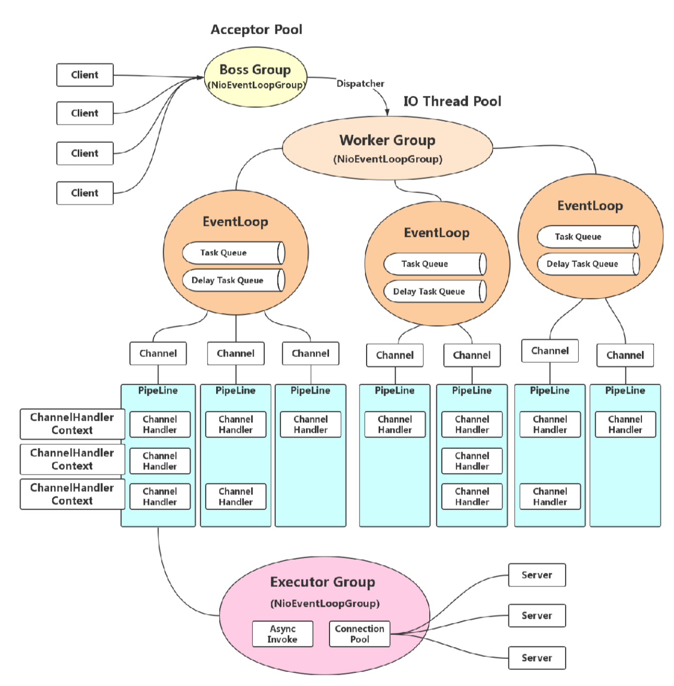

# Java 同步异步、阻塞非阻塞、BIO,NIO,AIO,IO多路复用、reactor线程模型、Netty、reactor 响应式编程 ,reactor-netty、WebFlux

> 几年以前从PHP转Java，刚把Java基础语法学完，就从一本《Netty权威指南》开始了我的Java第一个线上应用，一个基于Netty的消息订阅服务，现在这个服务已经被Spring Boot WebFlux 重构了，现在回看当初写的代码，会心一笑，真是初出茅庐不怕虎。
> 这次借着课程从学Netty的机会，将之前学的知识重新整理一遍，理清思路，加深印象。

> 注：以下代码示例，只为说明不同概念对应的简单编码示例，不纠结于是否严谨。

## 同步异步、阻塞非阻塞

* 同步和异步关注的是消息通信机制 (synchronous communication/ asynchronous communication)
    * 所谓同步，就是在发出一个调用时，在没有得到结果之前，该调用就不返回。
    ``` 
        public class Synchronous {
            public static void main(String[] args) {
                //主线程等待返回结果
                String res = call();
                System.out.println(res);
            }
            public static String call(){
                try {
                    TimeUnit.SECONDS.sleep(1);
                }catch (InterruptedException e){
        
                }
                return "ready";
            }
        }
    ```
    * 异步则是相反，调用在发出之后，这个调用就直接返回了，所以没有返回结果。
    ``` 
    public class Asynchronous {
        private static ExecutorService executors = Executors.newFixedThreadPool(1);
        public static void main(String[] args) {
            //主线程不等待返回结果
            asyncCall( res -> {
                System.out.println(res);
            });
        }
        public static void asyncCall(Consumer<String> consumer){
            executors.execute(() -> {
                try {
                    TimeUnit.SECONDS.sleep(1);
                }catch (InterruptedException e){
    
                }
                consumer.accept("ready");
            });
        }
    }
    ``` 
    
* 阻塞和非阻塞关注的是程序在等待调用结果（消息，返回值）时的状态.
    * 阻塞调用是指调用结果返回之前，当前线程会被挂起，调用线程只有在得到结果之后才会返回。
    ``` 
    public class Blocking {
        public static void main(String[] args) {
            //调用发起后主线程将被挂起,直到结果返回
            String res = blockCall();
            System.out.println(res);
        }
        public static String blockCall(){
            try {
                TimeUnit.SECONDS.sleep(1);
            }catch (InterruptedException e){
    
            }
            return "ready";
        }
    }
    ```
    * 非阻塞调用指在不能立刻得到结果之前，该调用不会阻塞当前线程。
    ``` 
    public class NonBlocking {
        public static void main(String[] args) {
            NonBlock nonBlock = new NonBlock();
            //调用发起后主线程不会被挂起 , 可以另起线程去得到结果
            int state = nonBlock.call();
            new Thread(() -> {
                while (true){
                    if(state == 1){
                        System.out.println(nonBlock.getRes());
                    }
                }
            }).start();
            System.out.println("todo other things ...");
        }
        public static class NonBlock{
            private volatile int state = 0;
            private static ExecutorService executors = Executors.newFixedThreadPool(1);
            public int call(){
                executors.execute(() -> {
                    try {
                        TimeUnit.SECONDS.sleep(1);
                        state = 1;
                    }catch (InterruptedException e){
    
                    }
                });
                return state;
            }
            private String getRes(){
                state = 0;
                return "ready";
            }
            public int getState(){
                return state;
            }
        }
    } 
    ```
  
## BIO 同步阻塞IO
    > BIO 关注的是是否阻塞，无论是java.net包下提供的Socket编程接口还是java.nio包下提供的Socket接口，都有BIO的实现，下面两段代码演示了这样的情况，也就是说不是java.nio包下的socket编程就一定是NIO。
    ``` 
    /**
     * 同步阻塞IO示例
     * @author zhengyin zhengyinit@outlook.com
     * Create on 2020/11/1 4:45 下午
     */
    public class BioServerDemo1 {
        private final static ExecutorService EXECUTOR = Executors.newFixedThreadPool(10);
    
        /**
         * telnet 127.0.0.1 8100 测试
         * @param args
         * @throws IOException
         */
        public static void main(String[] args) throws IOException {
            ServerSocket serverSocket = new ServerSocket(8100);
            while (true){
                //阻塞到有结果返回
                Socket socket = serverSocket.accept();
                EXECUTOR.execute(() -> {
                    try {
                        PrintWriter printWriter = new PrintWriter(socket.getOutputStream(),true);
                        printWriter.write("Hello Client\n");
                        printWriter.close();
                        socket.close();
                    }catch (IOException e){
                        e.printStackTrace();
                    }
                });
            }
        }
    
    }
    ```
    
    ``` 
    /**
     * nio库的，同步阻塞的IO示例
     * @author zhengyin zhengyinit@outlook.com
     * Create on 2020/11/1 4:56 下午
     */
    public class BioServerDemo2 {
        private final static ExecutorService EXECUTOR = Executors.newFixedThreadPool(10);
    
        /**
         * 启动以后运行， telnet 127.0.0.1 8100 测试
         * @param args
         * @throws java.io.IOException
         */
        public static void main(String[] args) throws IOException {
            ServerSocketChannel serverSocket = ServerSocketChannel.open();
            try{
                serverSocket.socket().bind(new InetSocketAddress(8100));
                while(true){
                    //阻塞到有结果返回
                    SocketChannel socketChannel =  serverSocket.accept();
                    EXECUTOR.execute(() -> {
                        try {
                            byte[] response = "Hello Client\n".getBytes();
                            ByteBuffer buffer = ByteBuffer.allocate(response.length);
                            //响应客户端消息
                            buffer.put(response);
                            buffer.flip();
                            if(buffer.hasRemaining()){
                                try {
                                    socketChannel.write(buffer);
                                }catch (IOException e){
                                    e.printStackTrace();
                                }
                            }
                        }finally {
                            try {
                                socketChannel.close();
                            } catch (IOException e) {
                                e.printStackTrace();
                            }
                        }
                    });
                }
            }finally{
                serverSocket.close();
            }
        }
    }
    ```
## NIO 同步非阻塞IO / 多路复用IO（IO multiplexing） 
    > 传统NIO模型和阻塞IO类比，内核会立即返回，返回后获得足够的CPU时间继续做其它的事情，但是用户进程需要不断的去询问内核数据是否就绪，这一阶段是阻塞的。
    > 多路复用IO是为了弥补传统NIO模型的不足，当用户进程调用了select，那么整个进程会被block，而同时，kernel会“监视”所有select负责的socket，当任何一个socket中的数据准备好了，select就会返回。
    > 同时多路复用IO将一个Socket分为了几个阶段，可以针对不同阶段进行相应的处理
    
    ``` 
        SelectionKey.OP_CONNECT		连接就绪
        SelectionKey.OP_ACCEPT		接收就绪
        SelectionKey.OP_READ		读就绪
        SelectionKey.OP_WRITE		写就绪
    ```
    
    > Nio多路复用的示例
    ```
    /**
     * 多路复用的Nio示例
     * @author zhengyin zhengyinit@outlook.com
     * Create on 2020/11/1 4:56 下午
     */
    public class NioMultiplexingServerDemo {
        private final static ExecutorService EXECUTOR = Executors.newFixedThreadPool(10);
        /**
         * 启动以后运行， telnet 127.0.0.1 8100 测试
         * @param args
         * @throws IOException
         */
        public static void main(String[] args) throws IOException {
            ServerSocketChannel serverSocketChannel = ServerSocketChannel.open();
            serverSocketChannel.socket().bind(new InetSocketAddress(8100));
    
            //不阻塞
            serverSocketChannel.configureBlocking(false);
            Selector selector = Selector.open();
            serverSocketChannel.register(selector, SelectionKey.OP_ACCEPT);
    
            while (true){
                //阻塞，直到有就绪的Key
                selector.select();
                Iterator keyIterator = selector.selectedKeys().iterator();
                while (keyIterator.hasNext()) {
                    SelectionKey selectionKey = (SelectionKey)keyIterator.next();
                    try {
                        if(selectionKey.isValid()){
    
                            if(selectionKey.isAcceptable()){
                                try {
                                    ServerSocketChannel ssc = (ServerSocketChannel)selectionKey.channel();
                                    //产生一个新的 socketChannel，处理客户端的数据
                                    SocketChannel socketChannel = ssc.accept();
                                    socketChannel.configureBlocking(false);
                                    //注册一个已读的事件监听
                                    socketChannel.register(selector, SelectionKey.OP_READ);
                                }catch (IOException e){
                                    e.printStackTrace();
                                }
                            }
                            //读就绪
                            if(selectionKey.isReadable()){
                                SocketChannel socketChannel = (SocketChannel) selectionKey.channel();
                                try {
                                    byte[] response = "Hello Client\n".getBytes();
                                    ByteBuffer buffer = ByteBuffer.allocate(response.length);
                                    //响应客户端消息
                                    buffer.put(response);
                                    buffer.flip();
                                    if(buffer.hasRemaining()){
                                        try {
                                            socketChannel.write(buffer);
                                        }catch (IOException e){
                                            e.printStackTrace();
                                        }
                                    }
                                }finally {
                                    try {
                                        socketChannel.close();
                                    } catch (IOException e) {
                                        e.printStackTrace();
                                    }
                                }
                            }
                        }
                    } catch (Exception e) {
                        e.printStackTrace();
                        if (selectionKey != null) {
                            selectionKey.cancel();
                            selectionKey.channel().close();
                        }
                    }
                    keyIterator.remove();
                }
            }
        }
    
    
    }
    
    ```

## AIO 异步IO

    > Linux下的asynchronous IO其实用得不多，从内核2.6版本才开始引入。用户进程发起read操作之后，立刻就可以开始去做其它的事。而另一方面，从kernel的角度，当它受到一个asynchronous read之后，首先它会立刻返回，所以不会对用户进程产生任何block。
    
    ``` 
    
    /**
     * Aio Server 示例
     * @author zhengyin zhengyinit@outlook.com
     * Create on 2020/11/1 6:50 下午
     */
    public class AioServerDemo {
    
        public static void main(String[] args) throws IOException,InterruptedException {
            AsynchronousChannelGroup group = AsynchronousChannelGroup.withCachedThreadPool(Executors.newFixedThreadPool(10), 3);
            AsynchronousServerSocketChannel serverChannel = AsynchronousServerSocketChannel.open(group);
            serverChannel.bind(new InetSocketAddress(8100));
            ListenerHandler listenerHandler = new ListenerHandler(serverChannel);
            listenerHandler.doAccept(new AcceptCompileHandler());
    
            while (true){
                TimeUnit.SECONDS.sleep(1);
            }
        }
    
    
        public static class ListenerHandler extends Thread{
            private AsynchronousServerSocketChannel serverChannel;
            public ListenerHandler(AsynchronousServerSocketChannel serverChannel) {
                this.serverChannel = serverChannel;
            }
            public void doAccept(AcceptCompileHandler acceptCompileHandler){
                this.serverChannel.accept(this,acceptCompileHandler);
            }
            public void doAccept(ListenerHandler listenerHandler,AcceptCompileHandler acceptCompileHandler){
                this.serverChannel.accept(listenerHandler, acceptCompileHandler);
            }
        }
    
        private static class AcceptCompileHandler implements CompletionHandler<AsynchronousSocketChannel, ListenerHandler> {
            @Override
            public void completed(AsynchronousSocketChannel socketChannel, ListenerHandler listenerHandler) {
                //继续监听客户端连接
                listenerHandler.doAccept(listenerHandler, this);
                //读数据
                ByteBuffer buffer = ByteBuffer.allocate(128);
                socketChannel.read(buffer, buffer, new ReadCompileHandler(socketChannel));
            }
            @Override
            public void failed(Throwable exc, ListenerHandler listenerHandler) {
                exc.printStackTrace();
            }
        }
    
        private static class  ReadCompileHandler implements CompletionHandler<Integer, ByteBuffer> {
            private AsynchronousSocketChannel socketChannel;
            public ReadCompileHandler(AsynchronousSocketChannel socketChannel) {
                this.socketChannel = socketChannel;
            }
    
            @Override
            public void completed(Integer readSize, ByteBuffer buffer) {
                try {
                    write("Hello Client\n");
                }finally {
                    try {
                        socketChannel.close();
                    }catch (IOException e){
                        e.printStackTrace();
                    }
                }
            }
            @Override
            public void failed(Throwable exc, ByteBuffer attachment) {
                exc.printStackTrace();
            }
    
            private void write(String msg){
                byte[] bytes = msg.getBytes();
                ByteBuffer buffer = ByteBuffer.allocate(bytes.length);
                buffer.put(bytes);
                buffer.flip();
                socketChannel.write(buffer, buffer, new CompletionHandler<Integer, ByteBuffer>() {
                    @Override
                    public void completed(Integer result, ByteBuffer buffer) {
                        //没有发送完，接着发
                        if(buffer.hasRemaining()){
                            socketChannel.write(buffer, buffer, this);
                        }
                    }
                    @Override
                    public void failed(Throwable exc, ByteBuffer attachment) {
                        exc.printStackTrace();
                    }
                });
            }
        }
    }

    ```

## Reactor 线程模型

Reactor 模型的特点

1. 事件驱动
2. 可以处理一个或多个输入源
3. 通过多路复用将请求的事件分发给对应的处理器处理

从高新能的定义回看 Reactor 模型

* 高新能定义
    * 高并发用户
    * 高吞吐量
    * 低延迟

1. 单线程模型，只有一个线程负责接收、处理请求，不符合高并发用户
2. 多线程模型，只有一个线程负责接收，不能很好利用现代多核CPU的资源，出现大量并发用户的时候，忙不过来，无法hold住请求的流量，不符合高并发用户要求
3. 主从线程模型，能够hold住高并发的请求，而吞吐量与低延迟还需要考 Worker 线程处理的处理，Worker线程通常还需要监听 SocketChannel 的状态变化，因此切勿阻塞。

> 在Netty中，因为负责接收请求的BossGroup与负责进行处理请求的WorkerGroup都不能阻塞，为了减少线程调度，降低CPU上下文切换，因此通常设置我CPU核心数或CPU核心的倍数。

## Netty 




* 从原理上来讲，Netty使用Java Nio 库，是一个通过IO多路复用同步非阻塞的网络框架，在不同操作系统上会选用不同select的实现。

    * EPoll(Linux) kqueue (FreeBsd) Iocp (Windows)

* 从功能上来讲，Netty为开发者屏蔽了常见的网络协议底层实现的细节，提供大量的编码、解码工具类，对于后端开发，无论是网络协议开发，RPC调用都有不错的支持

* 从使用上里讲，开发者可以在Netty之上，通过提供的功能，编写业务的Handle完成业务逻辑开发，同时也可以实现自己的编码解码器，自定义私有协议栈，RPC框架等。


## reactor 响应式编程 ，Reactor Netty ,Webflux

 reactor 响应式编程 与  reactor 线程模型 名字一样，但是性质大不相同。reactor 面向流，类似于Java Stream 但是提供了比Java Stream 更多的API实现，Reactor 通过一系列操作符来串联起业务，是一个用于JVM的完全非阻塞的响应式编程框架。
 reactor 的特性和前面提到Netty Handle 结合就有了 Reactor-netty ，Reactor-netty 提供了非租塞的 Http client 与 Servers 实现。
 Spring 在Reactor-netty 的基础上实现了 Webflux 响应式的 Spring Web 框架，并且提供了支持响应式的Redis、jdbc等支持。
 
 
> 老师你好，因为时间关系，另外就是之前写过一个自定义协议的Sub服务，因此没有写金卫老师预留的作业，只对课程做了总结。